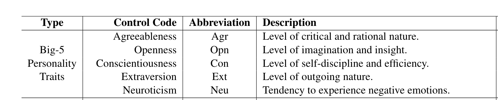
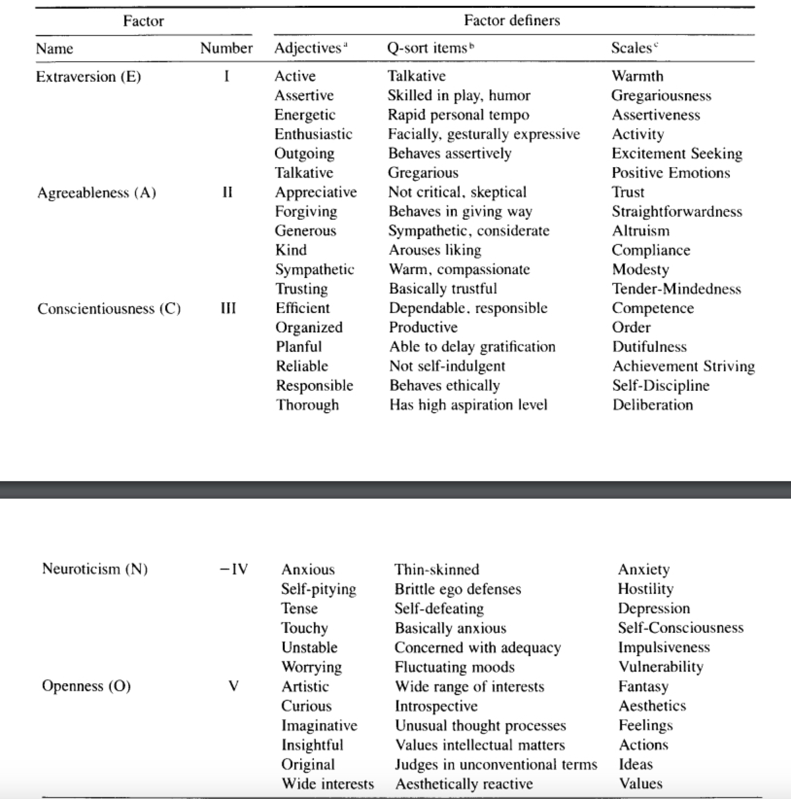
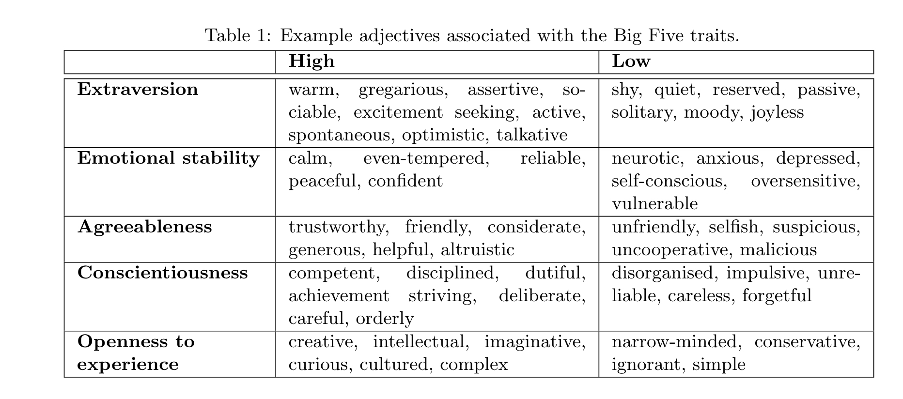

## 5 traits 
### Descriptions: 

### Adjectives :

## How to run:
- install streamlit: `pip install streamlit`
- Running `streamlit run eval_trait.py` starts a server and opens a tab in your browser with the first sample: A pair of dialogs and a radio buttom to specify which one (Model1 or Model2) has the "higer" mentioned attribute (or it's the same).
- You will be judging the `<agent>` traits from their utterances which (hopefully) are displayed as bold. On the left panel you see the Persona for `<agent>`. It is provided so that you can have a better judgement for that trait: ideally we look for manifestations of traits beyond the trivial implications of persona facts, but this is not always straitforward, so just have that in mind, and use it if applicable but don't push it! In addition, ignore explicit and bold references to traits, specially if used in the "noun" form (e.g. I have very high conscientiousness!).
- Clicking on `Next` after each annotation, shows the next pair. 
- At each point you can click on `Save&Exit` to save and exit. The results will be saved in the path mentioned in the `results` folder (`eval_trait.py`, line 34), along with a file called `last_session.json` which keeps track of sessions. Next time that you run the code, it will start from the place you left. 
- Don't click again on the `Save&Exit` button in the second (empty) page. 
- Stop the server by `Ctrl+c` (from the terminal) after you finished a session. 